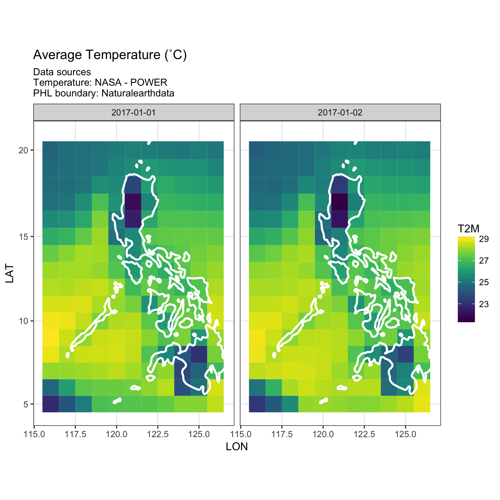

```{r setup, include=FALSE}
library(nasapower)
```

## Introduction

_nasapower_ aims to make it quick, easy and efficient to automate downloading
NASA-POWER agroclimatology data in your R session as a tidy data frame.

_nasapower_ only provides functions, `get_cell()`, for a given 1˚ longitude by 1˚ latitude cell and `get_region()`, both of which will which will download
specified variables and return a tidy data frame of the requested data. Weather
variables can be specified by using the `vars` argument. 

## Using get_cell()

The `get_cell()` function accepts four arguments.

```r
get_cell(lonlat = NULL, vars = c("T2M", "T2MN", "T2MX", "RH2M"),
  stdate = "1983-1-1", endate = Sys.Date())
```

- `lonlat` A length-2 numeric vector giving the decimal degree longitude and
and latitude in that order for cell data to download

- `lat` Latitude value to query (single value only)

- `vars` Weather variables to query for download. Valid `vars` include:

    * toa_dwn - Average top-of-atmosphere insolation (MJ/m^2/day)

    * swv_dwn - Average insolation incident on a horizontal surface (MJ/m^2/day)

    * lwv_dwn - Average downward longwave radiative flux (MJ/m^2/day)

    * T2M - Average air temperature at 2m above the surface of the Earth (degrees C)

    * T2MN - Minimum air temperature at 2m above the surface of the Earth (degrees C)

    * T2MX - Maximum air temperature at 2m above the surface of the Earth (degrees C)

    * RH2M - Relative humidity at 2m above the surface of the Earth (%)

    * DFP2M - Dew/Frost point temperature at 2m above the surface of the Earth (degrees C)

    * RAIN - Average precipitation (mm/day)

    * WS10M - Wind speed at 10m above the surface of the Earth (m/s)

- `stdate` Starting date for download, defaults to 01/01/1983 (there is no
earlier data)

- `endate` End date for download, defaults to current date

### Basic example of using get_cell()

Fetch T2M, T2MN, T2MX and RH2M for 1983-1-1 to current date for the cell at
longitude -179.5 and latitude -89.5.

```{r basic_example, eval=FALSE}
library(nasapower)

get_cell(lonlat = c(-179.5, -89.5))
```

### Specifying dates

By default `get_cell()` will use `1983-01-01` as a start date and the current
date as the end date. Following is an example of specifying the end date.

Specify only the end date, `1983-01-02`, using the default start date of
`1983-01-01`.

```{r specify_endate, eval=FALSE}
get_cell(lonlat = c(-179.5, -89.5), endate = "1983-01-02")
```

### Specifying variables

By default `get_cell()` will fetch `T2M`, `T2MN`, `T2MX`, `RH2M` weather
variables. Following is an example of specifying only one variable, `WS10M`,
for retrieval.

```{r specify_vars, eval=FALSE}
get_cell(lonlat = c(-179.5, -89.5), endate = "1983-01-02", vars = "WS10M")
```

## Using get_region()

The `get_region()` function accepts the same arguments as `get_cell()`, however,
the `lonlat` value is a length-4 numeric vector of the minimum longitude, maximum longitude, minimum latitude and maximum latitude.

This function is useful for retrieving whole states, countries or global
surfaces. This example illustrates fetching and graphing the average temperature
and relative humidity for the Philippines.

```{r get_philippines_example, eval = FALSE}
PHL_adm <- rnaturalearth::ne_countries(scale = 50,
                                       country = "Philippines",
                                       returnclass = "sp")

# get the bounding box from the sp object to instruct the `lonlat` values
PHL_lonlat <- sp::bbox(PHL_adm)

PHL <- get_region(lonlat = c(PHL_lonlat[1, 1],
                             PHL_lonlat[1, 2],
                             PHL_lonlat[2, 1],
                             PHL_lonlat[2, 2]), 
                  vars = c("T2M", "RH2M"),
                  stdate = "2017-1-1",
                  endate = "2017-1-2")
```


Using _ggplot_, plot the downloaded data with an outline from Naturalearthdata
for reference.

```{r plot_phl, eval=FALSE}
library(ggplot2)
library(viridis)

# Plot temperature
ggplot(PHL) +
  geom_tile(aes(x = LON, y = LAT, fill = T2M)) +
  scale_fill_viridis() +
   geom_polygon(data = PHL_adm, aes(x = long, y = lat, group = group), 
               fill = NA, color = "white", size = 1) +
  theme_bw() +
  coord_map() +
  ggtitle("Average Temperature (˚C)",
          subtitle = "Data sources\nTemperature: NASA - POWER\nPHL boundary: Naturalearthdata")

# Plot RH
ggplot(PHL, aes(x = LON, y = LAT, fill = RH2M)) +
  geom_tile() +
  scale_fill_viridis(option = "C") +
   geom_polygon(data = PHL_adm, aes(x = long, y = lat, group = group), 
               fill = NA, color = "white", size = 1) +
  theme_bw() +
  coord_map() +
    ggtitle("Average Relative Humidity (%)",
          subtitle = "Data sources\nRelative Humidity: NASA - POWER\nPHL boundary: Naturalearthdata")
```





## References

<https://power.larc.nasa.gov>

<https://power.larc.nasa.gov/documents/Agroclimatology_Methodology.pdf>
