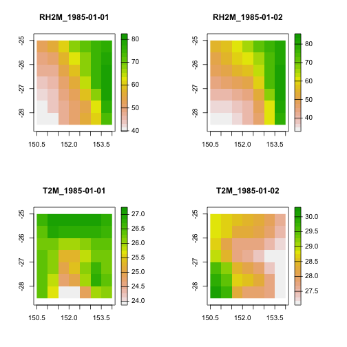
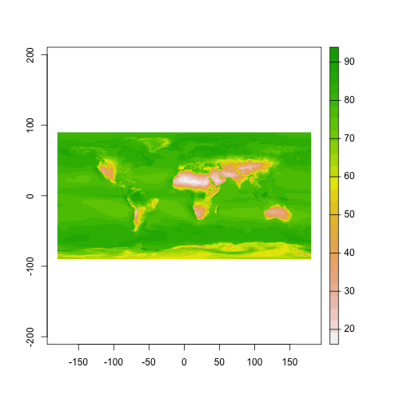
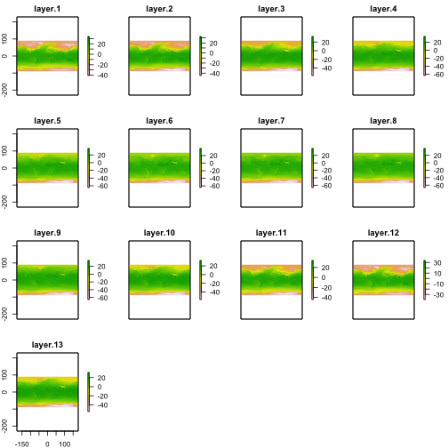

## Introduction

_nasapower_ aims to make it quick and easy to automate downloading
NASA [POWER](https://power.larc.nasa.gov) global meteorology, surface solar
energy amd climatology data  data in your R session as a tidy data frame for
analysis and use in modelling or other purposes using `get_power()`. POWER
(Prediction Of Worldwide Energy Resource) data are freely available for
download through a web interface at a resolution of 1/2 arc degree longitude
by 1/2 arc degree latitude. Two other functions are provided to quickly and
easily generate weather.met files from the POWER data for use in the
Agricultural Production Systems sIMulator (APSIM), `create_met()` and
International Consortium for Agricultural Systems Applications (ICASA) format
text files for use in the Decision Support System for Agrotechnology Transfer
(DSSAT) framework, `create_met()`.

## Using `get_power` to Fetch POWER Data

The `get_power()` function has five arguments as seen in this example and
returns a data frame with a metadata header in the current R session.

### Example fetching daily data for a single point

Fetch daily "AG" community temperature, relative humidity and precipitation
for January 1985 for Kingsthorpe, Queensland, Australia.


```r
library(nasapower)
daily_single_ag <- get_power(
  community = "AG",
  lonlat = c(151.81, -27.48),
  pars = c("RH2M", "T2M", "PRECTOT"),
  dates = c("1985-01-01", "1985-01-31"),
  temporal_average = "DAILY"
)

daily_single_ag
#> NASA/POWER SRB/FLASHFlux/MERRA2/GEOS 5.12.4 (FP-IT) 0.5 x 0.5 Degree Daily Averaged Data  
#>  Dates (month/day/year): 01/01/1985 through 01/31/1985  
#>  Location: Latitude  -27.48   Longitude 151.81  
#>  Elevation from MERRA-2: Average for 1/2x1/2 degree lat/lon region = 434.55 meters   Site = na  
#>  Climate zone: na (reference Briggs et al: http://www.energycodes.gov)  
#>  Value for missing model data cannot be computed or out of model availability range: -99  
#>  
#>  Parameters: 
#>  PRECTOT MERRA2 1/2x1/2 Precipitation (mm day-1) ;
#>  RH2M MERRA2 1/2x1/2 Relative Humidity at 2 Meters (%) ;
#>  T2M MERRA2 1/2x1/2 Temperature at 2 Meters (C)  
#>  
#> # A tibble: 31 x 10
#>      LON   LAT  YEAR    MM    DD   DOY YYYYMMDD    RH2M   T2M PRECTOT
#>    <dbl> <dbl> <dbl> <int> <int> <int> <date>     <dbl> <dbl>   <dbl>
#>  1  152. -27.5  1985     1     1     1 1985-01-01  48.9  25.1    1.07
#>  2  152. -27.5  1985     1     2     2 1985-01-02  41.8  28.4    0.5 
#>  3  152. -27.5  1985     1     3     3 1985-01-03  40.4  27.5    0.03
#>  4  152. -27.5  1985     1     4     4 1985-01-04  46.4  24.6    0.1 
#>  5  152. -27.5  1985     1     5     5 1985-01-05  50.8  26.5    2.13
#>  6  152. -27.5  1985     1     6     6 1985-01-06  58.6  26.8    5.32
#>  7  152. -27.5  1985     1     7     7 1985-01-07  61.1  27.0   11.9 
#>  8  152. -27.5  1985     1     8     8 1985-01-08  66.5  25.1    8.69
#>  9  152. -27.5  1985     1     9     9 1985-01-09  55.8  26.1    2.45
#> 10  152. -27.5  1985     1    10    10 1985-01-10  41.2  27.0    0.36
#> # … with 21 more rows
```

### Example fetching daily data for an area

Fetch daily "AG" community relative humidity and temperature for south east
Queensland region.


```r
daily_region_ag <- get_power(
  community = "AG",
  lonlat = c(150.5, -28.5 , 153.5, -25.5),
  pars = c("RH2M", "T2M"),
  dates = c("1985-01-01", "1985-01-02"),
  temporal_average = "DAILY"
)

daily_region_ag
#> NASA/POWER SRB/FLASHFlux/MERRA2/GEOS 5.12.4 (FP-IT) 0.5 x 0.5 Degree Daily Averaged Data  
#>  Dates (month/day/year): 01/01/1985 through 01/02/1985  
#>  Location: Regional  
#>  Elevation from MERRA-2: Average for 1/2x1/2 degree lat/lon region = na meters   Site = na  
#>  Climate zone: na (reference Briggs et al: http://www.energycodes.gov)  
#>  Value for missing model data cannot be computed or out of model availability range: -99  
#>  
#>  Parameters: 
#>  RH2M MERRA2 1/2x1/2 Relative Humidity at 2 Meters (%) ;
#>  T2M MERRA2 1/2x1/2 Temperature at 2 Meters (C)  
#>  
#> # A tibble: 98 x 9
#>      LON   LAT  YEAR    MM    DD   DOY YYYYMMDD    RH2M   T2M
#>    <dbl> <dbl> <dbl> <int> <int> <int> <date>     <dbl> <dbl>
#>  1  151. -28.2  1985     1     1     1 1985-01-01  39.7  26.5
#>  2  151. -28.2  1985     1     1     1 1985-01-01  40.4  25.8
#>  3  152. -28.2  1985     1     1     1 1985-01-01  47.0  24.0
#>  4  152. -28.2  1985     1     1     1 1985-01-01  51.8  23.9
#>  5  153. -28.2  1985     1     1     1 1985-01-01  56.2  24.9
#>  6  153. -28.2  1985     1     1     1 1985-01-01  62.5  26.0
#>  7  154. -28.2  1985     1     1     1 1985-01-01  74.7  26.1
#>  8  151. -27.8  1985     1     1     1 1985-01-01  41.3  26.5
#>  9  151. -27.8  1985     1     1     1 1985-01-01  43.4  26.0
#> 10  152. -27.8  1985     1     1     1 1985-01-01  47.6  24.8
#> # … with 88 more rows
```

### Example fetching interannual data for an area

Fetch interannual solar cooking parameters for south east Queensland region.


```r
interannual_sse <- get_power(
  community = "SSE",
  lonlat = c(150.5, -28.5 , 153.5, -25.5),
  dates = c("1984", "1985"),
  temporal_average = "INTERANNUAL",
  pars = c("CLRSKY_SFC_SW_DWN",
           "ALLSKY_SFC_SW_DWN")
)

interannual_sse
#> NASA/POWER SRB/FLASHFlux/MERRA2/GEOS 5.12.4 (FP-IT) 0.5 x 0.5 Degree Interannual Averages/Sums  
#>  Dates (month/day/year): 01/01/1984 through 12/31/1985  
#>  Location: Regional  
#>  Elevation from MERRA-2: Average for 1/2x1/2 degree lat/lon region = na meters   Site = na  
#>  Climate zone: na (reference Briggs et al: http://www.energycodes.gov)  
#>  Value for missing model data cannot be computed or out of model availability range: NA  
#>  
#>  Parameters: 
#>  ALLSKY_SFC_SW_DWN SRB/FLASHFlux 1/2x1/2 All Sky Insolation Incident on a Horizontal Surface (kW-hr/m^2/day) ;
#>  CLRSKY_SFC_SW_DWN SRB/FLASHFlux 1/2x1/2 Clear Sky Insolation Incident on a Horizontal Surface (kW-hr/m^2/day)  
#>  
#> # A tibble: 196 x 17
#>      LON   LAT PARAMETER  YEAR   JAN   FEB   MAR   APR   MAY   JUN   JUL
#>    <dbl> <dbl> <chr>     <dbl> <dbl> <dbl> <dbl> <dbl> <dbl> <dbl> <dbl>
#>  1  151. -28.2 CLRSKY_S…  1984  8.5   7.96  6.92  5.54  4.49  3.89  4.14
#>  2  151. -28.2 CLRSKY_S…  1985  8.87  8.1   6.94  5.6   4.44  4.03  4.2 
#>  3  151. -28.2 ALLSKY_S…  1984  6.11  6.83  6.28  4.6   4.02  3.46  2.58
#>  4  151. -28.2 ALLSKY_S…  1985  8.2   7.15  6.02  4.79  3.89  3.44  3.8 
#>  5  151. -28.2 CLRSKY_S…  1984  8.45  8.09  6.77  5.5   4.41  3.95  4.15
#>  6  151. -28.2 CLRSKY_S…  1985  8.76  8.03  6.93  5.57  4.39  3.93  4.2 
#>  7  151. -28.2 ALLSKY_S…  1984  5.82  6.43  5.95  4.41  3.89  3.54  2.43
#>  8  151. -28.2 ALLSKY_S…  1985  7.98  6.86  5.74  4.46  3.67  3.34  3.8 
#>  9  152. -28.2 CLRSKY_S…  1984  8.45  8.09  6.77  5.5   4.41  3.95  4.15
#> 10  152. -28.2 CLRSKY_S…  1985  8.76  8.03  6.93  5.57  4.39  3.93  4.2 
#> # … with 186 more rows, and 6 more variables: AUG <dbl>, SEP <dbl>,
#> #   OCT <dbl>, NOV <dbl>, DEC <dbl>, ANN <dbl>
```

### Example fetching climatology data

Global data are only available for the climatology `temporal_average`, setting
this argument as such will fetch global data.

Fetch global "AG"" climatology for temperature and relative
humidity.


```r
climatology_ag <- get_power(
  community = "AG",
  pars = c("T2M", "RH2M"),
  lonlat = "GLOBAL",
  temporal_average = "CLIMATOLOGY"
)

climatology_ag
#> NASA/POWER SRB/FLASHFlux/MERRA2/GEOS 5.12.4 (FP-IT) 0.5 x 0.5 Degree Climatologies  
#>  22-year Additional Solar Parameter Monthly & Annual Climatologies (July 1983 - June 2005), 30-year Meteorological and Solar Monthly & Annual Climatologies (January 1984 - December 2013)  
#>  Location: Global  
#>  Value for missing model data cannot be computed or out of model availability range: -99  
#>  Parameter(s):  
#>  RH2M MERRA2 1/2x1/2 Relative Humidity at 2 Meters (%)  
#>  
#>  Parameters: 
#>  NA;
#>  T2M MERRA2 1/2x1/2 Temperature at 2 Meters (C)  
#>  
#> # A tibble: 518,400 x 16
#>      LON   LAT PARAMETER   JAN   FEB   MAR   APR   MAY   JUN   JUL   AUG
#>    <dbl> <dbl> <chr>     <dbl> <dbl> <dbl> <dbl> <dbl> <dbl> <dbl> <dbl>
#>  1 -180. -89.8 T2M       -29.0 -40.7 -52.9 -57.8 -59.1 -59.6 -61.3 -61.8
#>  2 -180. -89.8 RH2M       70.3  64.3  63.5  63.2  63.9  64.2  63.9  63.9
#>  3 -179. -89.8 T2M       -29.0 -40.7 -52.9 -57.8 -59.1 -59.6 -61.3 -61.8
#>  4 -179. -89.8 RH2M       70.3  64.3  63.4  63.2  63.9  64.2  63.9  63.9
#>  5 -179. -89.8 T2M       -29.0 -40.7 -52.9 -57.8 -59.1 -59.6 -61.3 -61.8
#>  6 -179. -89.8 RH2M       70.3  64.3  63.4  63.2  63.9  64.2  63.9  63.9
#>  7 -178. -89.8 T2M       -29.0 -40.7 -52.9 -57.8 -59.1 -59.6 -61.3 -61.8
#>  8 -178. -89.8 RH2M       70.3  64.3  63.4  63.2  63.9  64.2  63.9  63.9
#>  9 -178. -89.8 T2M       -29.0 -40.7 -52.9 -57.8 -59.1 -59.6 -61.3 -61.8
#> 10 -178. -89.8 RH2M       70.3  64.3  63.4  63.2  63.9  64.2  63.8  63.9
#> # … with 518,390 more rows, and 5 more variables: SEP <dbl>, OCT <dbl>,
#> #   NOV <dbl>, DEC <dbl>, ANN <dbl>
```

_Note_ the associated metadata in the data frame header are not saved if the
data are exported to a file format other than an R data format, _e.g._, .Rdata,
.rda or .rds.

### Description of parameters for `get_power`

- `community`, a text string with valid values of: "AG" (Agroclimatology), "SSE"
(Surface meteorology and Solar Energy) or "SB" (Sustainable Buildings). The
selected user community will affect the units of the parameter and the temporal
display of time series data (_e.g._, "AG" will use MJ/m^2^/day for radiation
units, while SSE and SB use kW/m^2^/day as units).

- `lonlat`, A numeric vector of geographic coordinates for a cell or region
  entered as x, y coordinates. Not used when `temporal_average` is set to
  "CLIMATOLOGY".

    - *For a single point* To get a specific cell, 1/2 x 1/2 degree, supply a
    length-two numeric vector giving the decimal degree longitude and latitude
    in that order for data to download,  *e.g.*, `lonlat = c(-89.5, -179.5)`.

    - *For regional coverage* To get a region, supply a length-four numeric
    vector as lower left (lon, lat) and upper right (lon, lat) coordinates,
    *e.g.*, `lonlat = c(xmin, ymin, xmax, ymax)` in that order for a given
    region, *e.g.*, a bounding box for the south-western corner of Australia:
    `lonlat = c(112.5, -55.5, 115.5, -50.5)`. *Max bounding box is 10 x 10
    degrees* of 1/2 x 1/2 degree data, *i.e.*, 100 points maximum in total.

  `pars`. A character vector of parameters to download. See `help(parameters)`
  for a full list of valid values and definitions.  If downloading
  "CLIMATOLOGY" a maximum of 3 `pars` can be specified at one time, for
  "DAILY" and "INTERANNUAL" a maximum of 20 can be specified at one time.

- `dates`, a vector of start and end dates for which to query the POWER
  API, *e.g.*, `dates = c("1983-01-01", "2017-12-31")`.

- `temporal_average`, a character vector of the desired temporal average(s).
  Valid values are "DAILY", "INTERANNUAL" and "CLIMATOLOGY".

## Using `create_met`

The `create_met()` function wraps `get_power()`, `prepareMet()` and
`writeMet()` from the [_APSIM_](https://CRAN.R-project.org/package=APSIM)
package to simplify creating .met files from POWER data for use in the
APSIM modelling framework.

Four arguments are passed to this function, `lonlat`, `dates`, `dsn` and
`file_out`.

- `lonlat`

    - *For a single point* To get a specific cell, 1/2 x 1/2 degree, supply a
    length-two numeric vector giving the decimal degree longitude and latitude
    in that order for data to download,  *e.g.*, `lonlat = c(-179.5, -89.5)`.

    - *For regional coverage* To get a region, supply a length-four numeric
    vector as lower left (lon, lat) and upper right (lon, lat) coordinates,
    *e.g.*, `lonlat = c(xmin, ymin, xmax, ymax)` in that order for a given
    region, *e.g.*, a bounding box for the south-western corner of Australia:
    `lonlat = c(112.5, -55.5, 115.5, -50.5)`. *Max bounding box is 10 x 10
    degrees* of 1/2 x 1/2 degree data, *i.e.*, 100 points maximum in total.

- `dates`, a vector of start and end dates for which to query the POWER
  API, *e.g.*, `dates = c("1983-01-01", "2017-12-31")`.

- `dsn`, a file path to the directory for writing the resulting file,
  _.e.g._, "~/Documents". If none is given, defaults to user's home directory.

- `file_out`, a file name for the resulting text file written to disk.
   If none is provided, defaults to "APSIM.met"

Get POWER values for a single point, Kingsthorpe, Queensland for 1985 and
create an APSIM weather.met object suitable for use in APSIM for crop modelling
and save it to local disk for use in `APSIM` modelling.


```r
create_met(
  lonlat = c(151.81, -27.48),
  dates = c("1985-01-01", "1985-12-31"),
  dsn = tempdir(),
  file_out = file.path(tempdir(), "Kingsthorpe.met")
)
#> Warning in file(fileName, "w"): cannot open file '/var/folders/
#> _x/gqh2xrvn4qb0qs5d8795n8vr0000gn/T//RtmpLMlK3Z//var/folders/_x/
#> gqh2xrvn4qb0qs5d8795n8vr0000gn/T//RtmpLMlK3Z/Kingsthorpe.met': No such file
#> or directory
#> Error in file(fileName, "w"): cannot open the connection
```

## Using `create_icasa`

The `create_icasa()` simplifies a `get_power()` query to create an ICASA file
for use in DSSAT modelling.

Four arguments are passed to this function, `lonlat`, `dates`, `dsn` and
`file_out`.

- `lonlat`

    - *For a single point* To get a specific cell, 1/2 x 1/2 degree, supply a
    length-two numeric vector giving the decimal degree longitude and latitude
    in that order for data to download,  *e.g.*, `lonlat = c(-179.5, -89.5)`.

    - *For regional coverage* To get a region, supply a length-four numeric
    vector as lower left (lon, lat) and upper right (lon, lat) coordinates,
    *e.g.*, `lonlat = c(xmin, ymin, xmax, ymax)` in that order for a given
    region, *e.g.*, a bounding box for the south-western corner of Australia:
    `lonlat = c(112.5, -55.5, 115.5, -50.5)`. *Max bounding box is 10 x 10
    degrees* of 1/2 x 1/2 degree data, *i.e.*, 100 points maximum in total.

- `dates`, a vector of start and end dates for which to query the POWER
  API, *e.g.*, `dates = c("1983-01-01", "2017-12-31")`.

- `dsn`, a file path to the directory for writing the resulting file,
  _.e.g._, "~/Documents". If none is given, defaults to user's home directory.

- `file_out`, a  file name for the resulting text file written to disk.
   If none is provided, defaults to "ICASA.txt"

Get POWER values for a single point, Kingsthorpe, Queensland for 1985 and
create an ICASA text file suitable for use in `DSSAT` for crop modelling and
save it to local disk.


```r
create_icasa(
  lonlat = c(151.81, -27.48),
  dates = c("1985-01-01", "1985-12-31"),
  dsn = tempdir(),
  file_out = file.path(tempdir(), "Kingsthorpe_ICASA.txt")
)
```

## Creating Spatial Objects from `get_power`

If you require spatial objects to work with, it is rather simple to convert
the resulting tidy data frame from `get_power()` to a spatial object in R using
`raster::rasterFromXYZ()`.

### Converting Regional Data to a _raster_ Object

Using `lapply` and `split` it is easy to create stacks of raster objects from
a regional query.


```r
library(raster)
# Use split to create a list of data frames split by YYYYMMDD
daily_region_ag <- split(daily_region_ag, daily_region_ag$YYYYMMDD)

# Remove date information from data frame, list names will carry YYYYMMDD
daily_region_ag <-
  lapply(daily_region_ag, function(x)
    x[(!names(x) %in% c("YEAR", "MM", "DD", "DOY", "YYYYMMDD"))])

# Create a list of raster bricks from each YYYYMMDD data frame
raster_list <- lapply(daily_region_ag, rasterFromXYZ,
                      crs = "+proj=eqc +lat_ts=0 +lat_0=0 +lon_0=0 +x_0=0 +y_0=0 +ellps=WGS84 +datum=WGS84 +units=m +no_defs")

stack_names <-
  paste0(names(raster_list), rep(c("_RH2M", "_T2M"), 2))

raster_stack <- stack(unlist(raster_list))
names(raster_stack) <- stack_names
```

Plot all the items in the stack.


```r
plot(raster_stack)
```



### Converting Global Climatology to a _raster_ Object

Converting global climatology to a `raster` objects is as simple as querying
and then converting the resulting `tibble` to a _raster_ object using `raster::rasterFromXYZ()`<sup>*</sup>. Illustrated here using the `climatology_ag` object previously created are two methods.

<sub>*: You may experience issues if you have <16GB RAM available converting the entire object to a `raster::brick()`.</sub>

#### For low-memory systems

For low-memory systems (e.g. a recent Apple Mac computer with 8GB RAM), it is useful to have as much of your R global environment free from objects that take much memory and make sure other processes are not using system memory.

Using indexing pick the month or annual value and create a raster object.


```r
# split data frame into data frames for each parameter in a list
climatology_list <- split(climatology_ag, climatology_ag$PARAMETER)

# Remove PARAMETER information from data frame, list names supply this
climatology_list <-
  lapply(climatology_list, function(x) {
    x["PARAMETER"] <- NULL
    x
  })

RH2M_ann <- rasterFromXYZ(climatology_list$RH2M[c(1:2, 15)],
                          crs = "+proj=eqc +lat_ts=0 +lat_0=0 +lon_0=0 +x_0=0 +y_0=0 +ellps=WGS84 +datum=WGS84 +units=m +no_defs")

RH2M_ann
#> class      : RasterLayer 
#> dimensions : 360, 720, 259200  (nrow, ncol, ncell)
#> resolution : 0.5, 0.5  (x, y)
#> extent     : -180, 180, -90, 90  (xmin, xmax, ymin, ymax)
#> crs        : +proj=eqc +lat_ts=0 +lat_0=0 +lon_0=0 +x_0=0 +y_0=0 +ellps=WGS84 +datum=WGS84 +units=m +no_defs +towgs84=0,0,0 
#> source     : memory
#> names      : ANN 
#> values     : 15.88, 93.92  (min, max)

plot(RH2M_ann)
```



#### For systems with more available memory

For systems with RAM of ~16GB or more, it is possible to create a `raster::brick()` of the resulting POWER query. To do so, subset the `tibble()` for the desired parameter and drop the `PARAMETER` column.


```r
T2M_brick <- rasterFromXYZ(subset(climatology_ag, PARAMETER == "T2M")[-3])

T2M_brick
#> class      : RasterBrick 
#> dimensions : 360, 720, 259200, 13  (nrow, ncol, ncell, nlayers)
#> resolution : 0.5, 0.5  (x, y)
#> extent     : -180, 180, -90, 90  (xmin, xmax, ymin, ymax)
#> crs        : NA 
#> source     : memory
#> names      :    JAN,    FEB,    MAR,    APR,    MAY,    JUN,    JUL,    AUG,    SEP,    OCT,    NOV,    DEC,    ANN 
#> min values : -40.88, -44.85, -57.06, -62.95, -65.00, -64.50, -66.26, -66.74, -65.38, -57.44, -44.34, -39.79, -54.75 
#> max values :  34.08,  32.84,  32.77,  34.30,  37.09,  39.34,  39.13,  38.65,  35.04,  32.46,  34.20,  33.83,  32.23

plot(T2M_brick)
```



## References

<https://power.larc.nasa.gov>

<https://power.larc.nasa.gov/documents/POWER_Data_v9_methodology.pdf>
