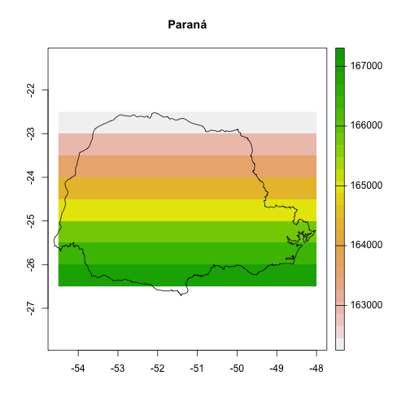
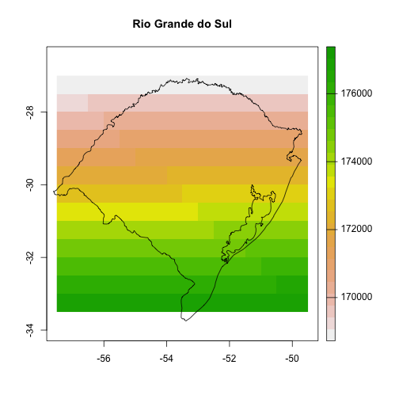

Fetching POWER data using `nasapower` for small, single queries is easy and straightforward.
However, if you wish to have daily data for a larger area it can be trickier to implement.

Here I demonstrate fetching multiple seasons of rainfall data for two states in Brazil and two growing seasons using `nasapower`.
An example of this use case can be found in Emerson Del Ponte's slide deck from the International Congress of Plant Pathology, 2019, ["Can rainfall be a useful predictor of epidemic risk across temporal and spatial scales?"](https://speakerdeck.com/emdelponte/can-rainfall-be-a-useful-predictor-of-epidemic-risk-across-temporal-and-spatial-scales?slide=23)

## Load libraries

To get the rainfall data for the states in Brazil, we will use `nasapower` (Sparks 2019), `rnaturalearth` (South 2017), `terra` (Hijmans 2020) packages to fetch the data, `dplyr` (Wickham et al. 2019) for data manipulation and `ggplot2` (Wickham 2016) to visualise the final data.


```r
library("rnaturalearth")
library("terra")
library("dplyr")
library("nasapower")
library("ggplot2")
library("purrr")
```

## Data import

To get the state data we will use `rnaturalearth` to download simple features data for Brazil and subset the states Rio Grande do Sul and Paraná into separate objects.


```r
BRA <- ne_states(country = "Brazil",
                 returnclass = "sf")

# subset spatial objects of only the states of interest
RS <- BRA[BRA$name_en == "Rio Grande do Sul", ]
PR <- BRA[BRA$name_en == "Paraná", ]
```

## Get the rainfall data

Now that we have objects for the states we can create a raster grid to represent the 0.5 x 0.5 degree grid that is the NASA-POWER data and select only cells that fall within the two states of interest.

### POWER source

Create a grid of 0.5 x 0.5 arc degrees and extract the x, y values from it for each state to use the coordinates to query the POWER data.


```r
# create a global 0.5 x 0.5 degree raster object
r <- rast(xmn = -180,
          xmx = 180,
          ymn = -90,
          ymx = 90,
          resolution = 0.5)

values(r) <- 1:ncell(r)

plot(r, main = "Full global raster at 0.5 x 0.5 degrees")
```


```r

# Extract the two states, first crop by bounding box, then mask the raster
PR_coords <- crop(r, PR)
RS_coords <- crop(r, RS)

PR_coords <- mask(PR_coords, vect(PR))
plot(PR_coords, main = "Paraná")
# add the sf object, note the use of indexing to plot only the first column
# to avoid warning messages
plot(PR[, 1], col = NA, add = TRUE)
```



```r

RS_coords <- mask(RS_coords, vect(RS))
plot(RS_coords, main = "Rio Grande do Sul")
plot(RS[, 1], col = NA, add = TRUE)
```



```r

# extract the centroid values of the cells to use querying the POWER data
PR_coords <-
  na.omit(as.data.frame(PR_coords, xy = TRUE))
RS_coords <-
  na.omit(as.data.frame(RS_coords, xy = TRUE))
names(PR_coords) <- names(RS_coords) <- c("LON", "LAT")
coords <- rbind(PR_coords, RS_coords)
```

**WARNING** This step is time intensive. **WARNING**

Using nested `for()` loops, query the NASA-POWER database to gather precipitation data for the states where rust was reported and save a CSV file of the rainfall.


```r
power <- vector(mode = "list", 2) # hold two growing seasons
precip <- vector(mode = "list", nrow(coords)) # hold the cells

seasons <- list(
  c("2014-11-01", "2015-03-31"),
  c("2015-11-01", "2016-03-31")
)

for (i in seq_along(seasons)) {
  # two "seasons" (outer loop 2x)
  season <- seasons[[i]]

  # inner loop for each pair coords
  for (j in seq_along(1:nrow(coords))) {
    NA_df <-
      data.frame(
        LON = coords[1, 1],
        LAT = coords[1, 2],
        YEAR = NA,
        MM = NA,
        DD = NA,
        DOY = NA,
        YYYYMMDD = NA,
        PRECTOT = NA
      )

    p_get_power <- possibly(get_power, otherwise = NA_df)

    # 312 coordinate pairs (inner loop 312x)
    site <- as.numeric(coords[j,])
    power_precip <- p_get_power(
      community = "AG",
      lonlat = site,
      pars = "PRECTOT",
      dates = season,
      temporal_average = "DAILY"
    )
    precip[[j]] <- power_precip
    Sys.sleep(5) # wait 5 seconds between requests so we don't hammer the server
  }
  precip_df <- bind_rows(precip)
  power[[i]] <- precip_df
}
power_df <- bind_rows(power)

# adds states to rows
power_df <- data.frame(STATE = c(rep("PR", nrow(PR_coords)),
                                 rep("RS", nrow(RS_coords))),
                       power_df)
```

## Acknowledgements

> These data were obtained from the NASA Langley Research Center POWER Project funded through the NASA Earth Science Directorate Applied Science Program.

## References

Lionel Henry and Hadley Wickham (2019). purrr: Functional Programming Tools.
  R package version 0.3.2. https://CRAN.R-project.org/package=purrr

Robert J. Hijmans (2020). terra: Spatial Data Analysis. R package version 0.7-11.
  https://CRAN.R-project.org/package=terra

Andy South (2017). _rnaturalearth: World Map Data from Natural Earth_. R package
  version 0.1.0. https://CRAN.R-project.org/package=rnaturalearth

Adam Sparks (2018). nasapower: A NASA POWER Global Meteorology, Surface Solar
  Energy and Climatology Data Client for R. Journal of Open Source Software,
  3(30), 1035, https://doi.org/10.21105/joss.01035

Adam Sparks (2019). _nasapower: NASA-POWER Data from R_. R package version 1.1.2,
  <URL: https://CRAN.R-project.org/package=nasapower>.

Hadley Wickham. ggplot2: Elegant Graphics for Data Analysis. Springer-Verlag
  New York, 2016.

Hadley Wickham, Romain François, Lionel Henry and Kirill Müller (2019). dplyr: A
  Grammar of Data Manipulation. R package version 0.8.3.
  https://CRAN.R-project.org/package=dplyr

## Session information


```r
sessioninfo::session_info()
#> ─ Session info ───────────────────────────────────────────────────
#>  setting  value                       
#>  version  R version 4.0.2 (2020-06-22)
#>  os       macOS Catalina 10.15.6      
#>  system   x86_64, darwin17.0          
#>  ui       RStudio                     
#>  language (EN)                        
#>  collate  en_AU.UTF-8                 
#>  ctype    en_AU.UTF-8                 
#>  tz       Australia/Brisbane          
#>  date     2020-09-23                  
#> 
#> ─ Packages ───────────────────────────────────────────────────────
#>  package            * version    date       lib
#>  APSIM                0.9.3      2019-05-22 [1]
#>  assertthat           0.2.1      2019-03-21 [1]
#>  base64enc            0.1-3      2015-07-28 [1]
#>  bit                  4.0.4      2020-08-04 [1]
#>  bit64                4.0.5      2020-08-30 [1]
#>  blob                 1.2.1      2020-01-20 [1]
#>  class                7.3-17     2020-04-26 [2]
#>  classInt             0.4-3      2020-04-07 [1]
#>  cli                  2.0.2      2020-02-28 [1]
#>  codetools            0.2-16     2018-12-24 [2]
#>  colorspace           1.4-1      2019-03-18 [1]
#>  crayon               1.3.4.9000 2020-09-19 [1]
#>  crul                 1.0.0      2020-07-30 [1]
#>  curl                 4.3        2019-12-02 [1]
#>  data.table           1.13.1     2020-08-19 [1]
#>  DBI                  1.1.0      2019-12-15 [1]
#>  digest               0.6.25     2020-02-23 [1]
#>  dplyr              * 1.0.2      2020-08-18 [1]
#>  e1071                1.7-3      2019-11-26 [1]
#>  ellipsis             0.3.1      2020-05-15 [1]
#>  evaluate             0.14       2019-05-28 [1]
#>  fansi                0.4.1      2020-01-08 [1]
#>  fauxpas              0.5.0      2020-04-13 [1]
#>  fs                   1.5.0      2020-07-31 [1]
#>  generics             0.0.2      2018-11-29 [1]
#>  ggplot2            * 3.3.2      2020-06-19 [1]
#>  glue                 1.4.2      2020-08-27 [1]
#>  gtable               0.3.0      2019-03-25 [1]
#>  highr                0.8        2019-03-20 [1]
#>  hms                  0.5.3      2020-01-08 [1]
#>  htmltools            0.5.0      2020-06-16 [1]
#>  httpcode             0.3.0      2020-04-10 [1]
#>  httr                 1.4.2      2020-07-20 [1]
#>  jsonlite             1.7.1      2020-09-07 [1]
#>  KernSmooth           2.23-17    2020-04-26 [2]
#>  knitr              * 1.29       2020-06-23 [1]
#>  lattice              0.20-41    2020-04-02 [2]
#>  lazyeval             0.2.2      2019-03-15 [1]
#>  lifecycle            0.2.0      2020-03-06 [1]
#>  lubridate            1.7.9      2020-06-08 [1]
#>  magrittr             1.5        2014-11-22 [1]
#>  memoise              1.1.0      2017-04-21 [1]
#>  munsell              0.5.0      2018-06-12 [1]
#>  nasapower          * 1.1.3.9000 2020-09-21 [1]
#>  pillar               1.4.6      2020-07-10 [1]
#>  pkgconfig            2.0.3      2019-09-22 [1]
#>  plyr                 1.8.6      2020-03-03 [1]
#>  purrr              * 0.3.4      2020-04-17 [1]
#>  R6                   2.4.1      2019-11-12 [1]
#>  raster               3.3-13     2020-07-17 [1]
#>  Rcpp                 1.0.5      2020-07-06 [1]
#>  readr                1.3.1      2018-12-21 [1]
#>  rgdal                1.5-16     2020-08-07 [1]
#>  rgeos                0.5-5      2020-09-07 [1]
#>  rlang                0.4.7      2020-07-09 [1]
#>  rmarkdown            2.3        2020-06-18 [1]
#>  rnaturalearth      * 0.1.0      2017-03-21 [1]
#>  rnaturalearthhires   0.2.0      2020-08-25 [1]
#>  RSQLite              2.2.0      2020-01-07 [1]
#>  rstudioapi           0.11       2020-02-07 [1]
#>  scales               1.1.1      2020-05-11 [1]
#>  sessioninfo          1.1.1      2018-11-05 [1]
#>  sf                   0.9-6      2020-09-13 [1]
#>  sirad                2.3-3      2016-10-18 [1]
#>  sp                   1.4-2      2020-05-20 [1]
#>  stringi              1.5.3      2020-09-09 [1]
#>  stringr              1.4.0      2019-02-10 [1]
#>  terra              * 0.8-6      2020-08-01 [1]
#>  testthat             2.3.2      2020-03-02 [1]
#>  tibble               3.0.3      2020-07-10 [1]
#>  tidyselect           1.1.0      2020-05-11 [1]
#>  triebeard            0.3.0      2016-08-04 [1]
#>  units                0.6-7      2020-06-13 [1]
#>  urltools             1.7.3      2019-04-14 [1]
#>  usethis              1.6.3      2020-09-17 [1]
#>  utf8                 1.1.4      2018-05-24 [1]
#>  vcr                  0.5.4      2020-03-31 [1]
#>  vctrs                0.3.4      2020-08-29 [1]
#>  webmockr             0.6.2      2020-03-24 [1]
#>  whisker              0.4        2019-08-28 [1]
#>  withr                2.2.0      2020-04-20 [1]
#>  xfun                 0.17       2020-09-09 [1]
#>  yaml                 2.2.1      2020-02-01 [1]
#>  zoo                  1.8-8      2020-05-02 [1]
#>  source                       
#>  CRAN (R 4.0.2)               
#>  CRAN (R 4.0.2)               
#>  CRAN (R 4.0.2)               
#>  CRAN (R 4.0.2)               
#>  CRAN (R 4.0.2)               
#>  CRAN (R 4.0.2)               
#>  CRAN (R 4.0.2)               
#>  CRAN (R 4.0.2)               
#>  CRAN (R 4.0.2)               
#>  CRAN (R 4.0.2)               
#>  CRAN (R 4.0.2)               
#>  Github (r-lib/crayon@6b3f0c6)
#>  CRAN (R 4.0.2)               
#>  CRAN (R 4.0.1)               
#>  local                        
#>  CRAN (R 4.0.2)               
#>  CRAN (R 4.0.2)               
#>  CRAN (R 4.0.2)               
#>  CRAN (R 4.0.2)               
#>  CRAN (R 4.0.2)               
#>  CRAN (R 4.0.1)               
#>  CRAN (R 4.0.2)               
#>  CRAN (R 4.0.2)               
#>  CRAN (R 4.0.2)               
#>  CRAN (R 4.0.2)               
#>  CRAN (R 4.0.2)               
#>  CRAN (R 4.0.2)               
#>  CRAN (R 4.0.2)               
#>  CRAN (R 4.0.2)               
#>  CRAN (R 4.0.2)               
#>  CRAN (R 4.0.2)               
#>  CRAN (R 4.0.2)               
#>  CRAN (R 4.0.2)               
#>  CRAN (R 4.0.2)               
#>  CRAN (R 4.0.2)               
#>  CRAN (R 4.0.2)               
#>  CRAN (R 4.0.2)               
#>  CRAN (R 4.0.2)               
#>  CRAN (R 4.0.2)               
#>  CRAN (R 4.0.2)               
#>  CRAN (R 4.0.2)               
#>  CRAN (R 4.0.2)               
#>  CRAN (R 4.0.2)               
#>  CRAN (R 4.0.2)               
#>  CRAN (R 4.0.2)               
#>  CRAN (R 4.0.2)               
#>  CRAN (R 4.0.2)               
#>  CRAN (R 4.0.2)               
#>  CRAN (R 4.0.2)               
#>  CRAN (R 4.0.2)               
#>  CRAN (R 4.0.2)               
#>  CRAN (R 4.0.2)               
#>  CRAN (R 4.0.2)               
#>  CRAN (R 4.0.2)               
#>  CRAN (R 4.0.2)               
#>  CRAN (R 4.0.2)               
#>  CRAN (R 4.0.2)               
#>  local                        
#>  CRAN (R 4.0.2)               
#>  CRAN (R 4.0.2)               
#>  CRAN (R 4.0.2)               
#>  CRAN (R 4.0.2)               
#>  CRAN (R 4.0.2)               
#>  CRAN (R 4.0.2)               
#>  CRAN (R 4.0.2)               
#>  CRAN (R 4.0.2)               
#>  CRAN (R 4.0.2)               
#>  CRAN (R 4.0.2)               
#>  CRAN (R 4.0.2)               
#>  CRAN (R 4.0.2)               
#>  CRAN (R 4.0.2)               
#>  CRAN (R 4.0.2)               
#>  CRAN (R 4.0.2)               
#>  CRAN (R 4.0.2)               
#>  CRAN (R 4.0.2)               
#>  CRAN (R 4.0.2)               
#>  CRAN (R 4.0.2)               
#>  CRAN (R 4.0.2)               
#>  CRAN (R 4.0.2)               
#>  CRAN (R 4.0.2)               
#>  CRAN (R 4.0.2)               
#>  CRAN (R 4.0.2)               
#>  CRAN (R 4.0.2)               
#>  CRAN (R 4.0.2)               
#> 
#> [1] /Users/adamsparks/.R/library
#> [2] /Library/Frameworks/R.framework/Versions/4.0/Resources/library
```
